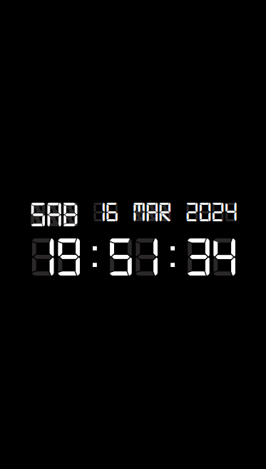
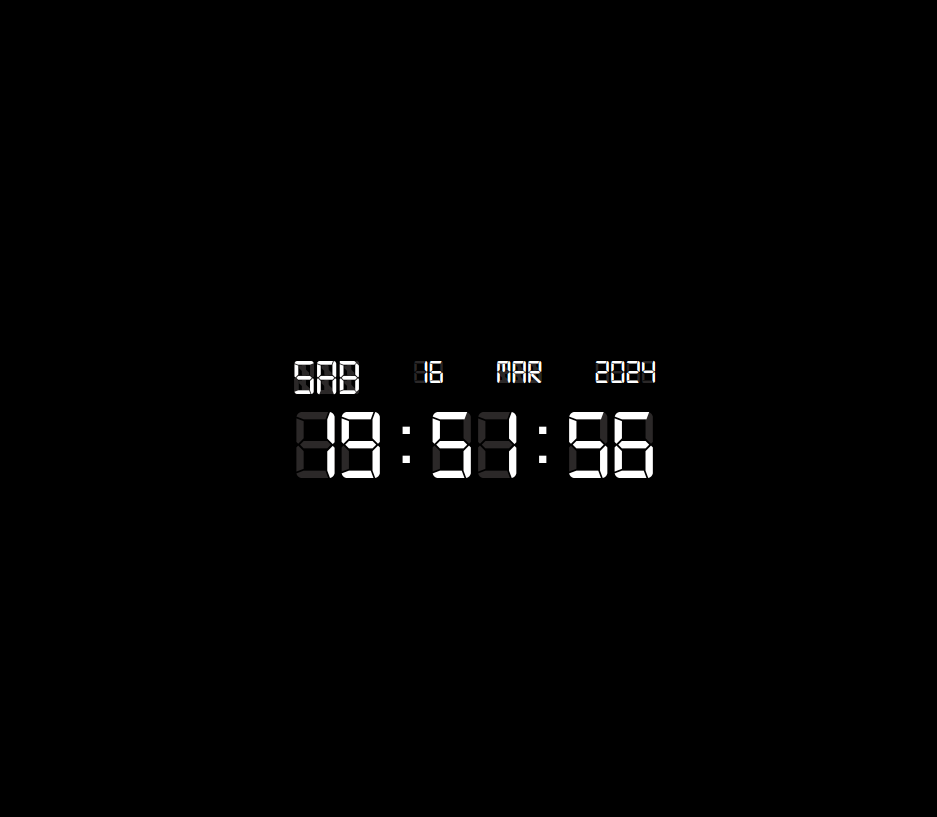

<h1 align="center">
    
</h1>

<h2 align="center">
  Relógio Digital
</h2>

<p align="center">
  <a href="#-demo">Demo</a>&nbsp;&nbsp;&nbsp;|&nbsp;&nbsp;&nbsp;
  <a href="#-tecnologias">Tecnologias</a>&nbsp;&nbsp;&nbsp;|&nbsp;&nbsp;&nbsp;
  <a href="#-projeto">Projeto</a>&nbsp;&nbsp;&nbsp;|&nbsp;&nbsp;&nbsp;
  <a href="#instalação">Instalação</a>
</p>

## 😀 Demo
<a href="https://andrearruda-clock.vercel.app">Dê uma olhada</a>
- Abra no navegador do celular e instale para usar offline
<br/>
<br/>
<br/>

## 🚀 Tecnologias
Esse projeto foi desenvolvido com as seguintes tecnologias:

- [React](https://reactjs.org)

## 💻 Projeto
**Relógio Digital no navegador**

## Instalação
### Pré requisitos
Ter instalado:
- [Node](https://nodejs.org/en/download/)
- [Yarn](https://classic.yarnpkg.com/en/docs/install/)

#### No terminal, rodar
```sh
# Clonar esse repositório
git clone https://github.com/andre23arruda/digital-clock

# Instalar os pacotes do projeto
yarn install

# Rodar
yarn start
```

<div align="center">
    
</div>
<hr>
<div align="center">
    
</div>
<hr>